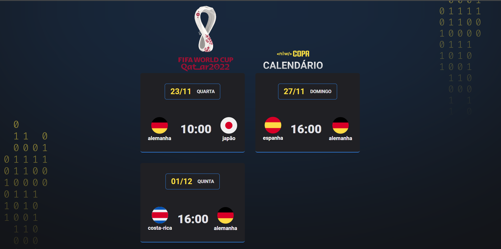

> Projeto de Calendário pessoal da Copa 2022

# Evento promovido de forma gratuita pela Rocketseat

  

# 🛠️ Tecnologias Utilizadas

 
    
  
  
  
  
  
  

 

# 👨‍🎓 O que aprendi

- Configurar a aparencia do VScode
- Trabalhar com as informações do Figma
- Compreender melhor as animações no CSS
- Como refatorar as informações no JavaScript

# 📧 Contato
<a href = "mailto:probertos717@gmail.com">